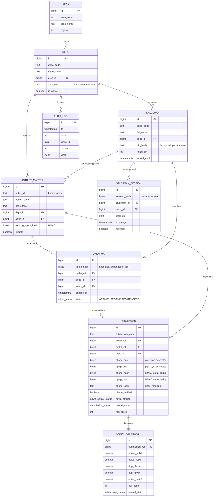
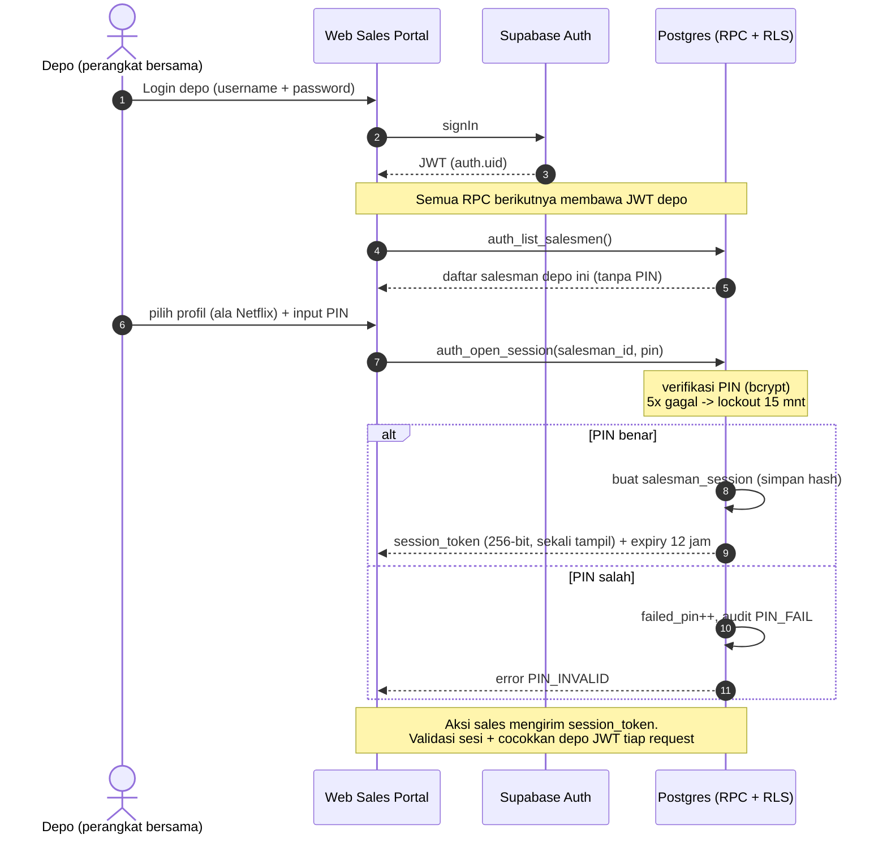
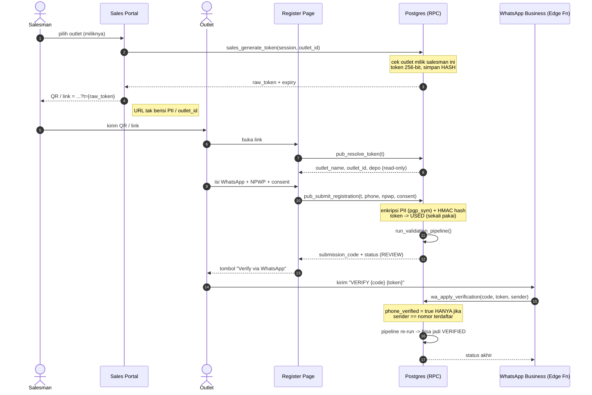
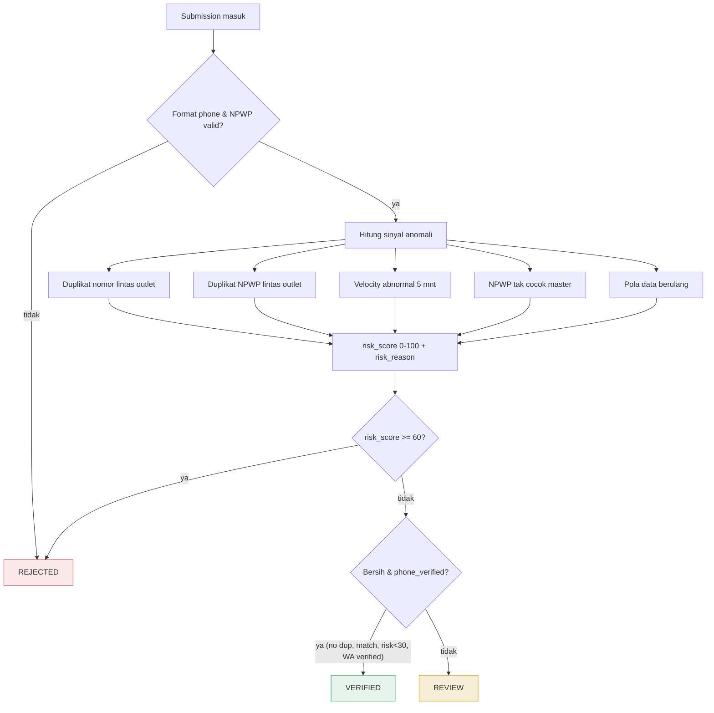
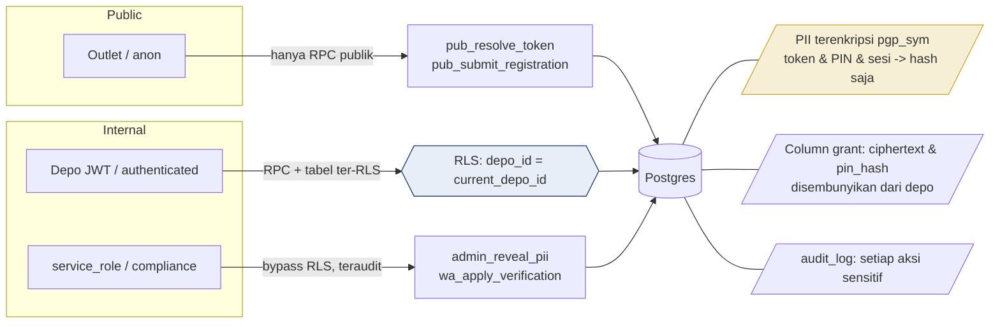

# Diagram Alur — Sayembara Outlet Nasional

Diagram Mermaid (otomatis ter-render di GitHub). Mencakup: ERD database,
alur autentikasi Depo + Salesman-PIN, alur registrasi outlet (token → submit →
validasi → WhatsApp), dan lapisan keamanan (RLS).

---

## 1. ERD — Entity Relationship Diagram

---

## 2. Alur Autentikasi — Depo + Salesman-PIN

---

## 3. Alur Registrasi Outlet — Token → Submit → Validasi → WhatsApp

---

## 4. Pipeline Validasi — Penentuan Status

---

## 5. Lapisan Keamanan (RLS + Enkripsi)

---

Sumber skema & fungsi: `db/01_schema.sql`, `db/02_rls.sql`, `db/03_functions.sql`.
Penjelasan lengkap: `docs/ARCHITECTURE.md`.
